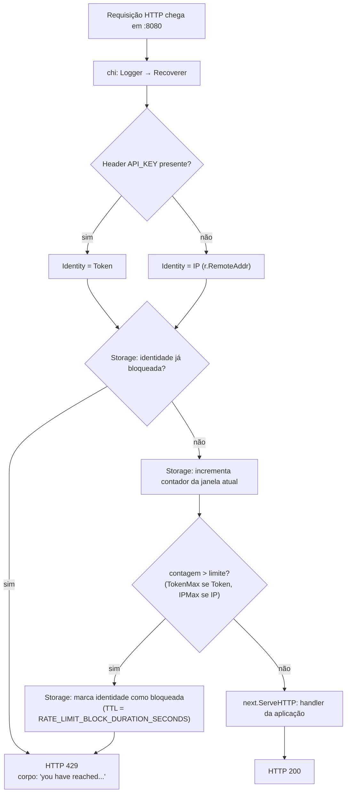

# Rate Limiter

Rate Limiter em Go que funciona como middleware HTTP, limitando requisições por **IP** ou por
**Token** de acesso (header `API_KEY`), com persistência em **Redis** via padrão **Strategy**.

## Sumário

- [Como instalar](#como-instalar)
- [Como executar o projeto](#como-executar-o-projeto)
- [Como rodar os testes](#como-rodar-os-testes)
- [Configuração](#configuração)
- [Arquitetura do projeto](#arquitetura-do-projeto)
- [Resumo de como o projeto foi feito](#resumo-de-como-o-projeto-foi-feito)

---

## Como instalar

O projeto foi pensado para viver **inteiramente dentro do Docker** — não é necessário ter Go
instalado na máquina, nem baixar dependências manualmente. Tudo isso acontece dentro da imagem
quando ela é construída.

Pré-requisitos: **Docker Engine 20.10+** com o plugin **Docker Compose V2**
(`docker compose`, já incluso no Docker Desktop — não o antigo binário
standalone `docker-compose` v1, hoje sem suporte). Testado com Docker
29.7.2 / Compose v5.4.0. O `Makefile` é opcional, só um atalho para os
comandos do compose.

Não há um passo de build separado: `docker compose` builda a imagem
sozinho (resolvendo as dependências do `go.mod` e compilando o binário no
estágio `builder` do `Dockerfile`) na primeira vez que você sobe o projeto
— veja "Como executar o projeto" a seguir.

## Como executar o projeto

```bash
make up
# equivalente a: docker compose up --build
```

Isso sobe dois serviços:

| Serviço | O que é | Porta |
|---|---|---|
| `redis` | Persistência do rate limiter | `6379` |
| `app`   | API HTTP do rate limiter | `8080` |

| Comando | O que faz |
|---|---|
| `make up` | Sobe redis + app em primeiro plano |
| `make stop` | Para os containers do projeto, sem removê-los |
| `make destroy` | Derruba containers, remove imagens locais (app/test), volumes e redes do projeto |
| `make logs` | Acompanha os logs do app |
| `make ps` | Lista os containers do projeto |

### Testando manualmente

```bash
# 10 requisições passam (limite padrão por IP), a partir da 11ª vem 429:
for i in $(seq 1 11); do curl -s -o /dev/null -w "%{http_code}\n" localhost:8080/; done

# Provando a precedência: mesmo IP bloqueado, mas com um token, passa normalmente:
curl -i -H "API_KEY: qualquer-token" localhost:8080/
```

Se quiser repetir o teste manual sem esperar os 5 minutos de bloqueio, zere o estado do Redis:

```bash
docker compose exec redis redis-cli FLUSHALL
```

## Como rodar os testes

Os testes também rodam só com Docker, sem precisar de Go instalado localmente:

```bash
make test
# equivalente a: docker compose run --build --rm test
```

Esse serviço builda até o estágio `builder` do `Dockerfile` (que ainda tem o código-fonte e o
toolchain do Go) e executa `go test ./... -v` com acesso ao Redis real do próprio compose —
então os testes de integração contra o Redis também são exercitados, não só os unitários.

## Configuração

Todas as configurações vêm de variáveis de ambiente, definidas no arquivo `.env` na raiz do
projeto (já commitado com valores padrão prontos para uso):

| Variável | Padrão | Descrição |
|---|---|---|
| `WEB_SERVER_PORT` | `8080` | Porta do servidor HTTP |
| `REDIS_HOST` | `localhost` | Host do Redis (o `docker-compose.yaml` sobrescreve para `redis`, o nome do serviço na rede interna) |
| `REDIS_PORT` | `6379` | Porta do Redis |
| `REDIS_PASSWORD` | *(vazio)* | Senha do Redis |
| `REDIS_DB` | `0` | Índice do banco Redis |
| `RATE_LIMIT_IP_MAX` | `10` | Máximo de requisições por janela para um IP |
| `RATE_LIMIT_TOKEN_MAX` | `100` | Máximo de requisições por janela para um Token (qualquer token) |
| `RATE_LIMIT_WINDOW_SECONDS` | `1` | Duração da janela de contagem |
| `RATE_LIMIT_BLOCK_DURATION_SECONDS` | `300` | Tempo de bloqueio (5 min) após exceder o limite |

Basta editar o `.env` e reiniciar (`docker compose up --build`) para mudar qualquer limite.

### Trocando a estratégia de persistência

A persistência segue o padrão **Strategy**: `internal/limiter` depende apenas da interface
`Storage` (`Increment`, `IsBlocked`, `Block`), definida em `internal/limiter/storage.go`. O
Redis (`internal/storage/redis`) é uma implementação; existe também uma implementação em
memória (`internal/storage/memory`), usada nos testes.

Para usar outro mecanismo de persistência no futuro:

1. Crie um novo pacote que implemente os 3 métodos de `limiter.Storage`.
2. Troque a instanciação em `cmd/server/main.go` (hoje é `redisstorage.New(rdb)`) pela do novo
   pacote.

Nenhum outro arquivo do projeto precisa mudar — nem o `Limiter`, nem o middleware, nem os testes
de negócio (que já usam a implementação em memória).

## Arquitetura do projeto

```
4-rate-limiter/
├── cmd/server/main.go        # monta config, redis, limiter e o router; sobe o servidor
├── configs/config.go         # carrega .env / variáveis de ambiente (viper)
├── internal/
│   ├── limiter/               # REGRA DE NEGÓCIO — não conhece HTTP nem Redis
│   │   ├── limiter.go          # Limiter.Allow(ctx, Identity) (bool, error)
│   │   └── storage.go          # interface Storage (contrato do Strategy)
│   ├── storage/
│   │   ├── redis/               # Strategy usada em produção
│   │   └── memory/               # 2ª Strategy: usada nos testes e como prova de que é trocável
│   └── httpmiddleware/         # ADAPTADOR HTTP — só traduz request ↔ Limiter
│       └── ratelimiter.go       # extrai IP/API_KEY, chama Allow, responde 429 quando bloqueado
├── Dockerfile                 # multi-stage: builder (Go) -> imagem final enxuta
├── docker-compose.yaml        # redis + app (8080) + test
└── .env                       # configuração padrão
```

**Por que essa divisão:** a regra de negócio (`internal/limiter`) não importa `net/http` nem
`chi` — recebe uma `Identity{Kind, Value}` e devolve `bool, error`. O middleware
(`internal/httpmiddleware`) não sabe como o limite é calculado — só sabe montar a `Identity` a
partir do request e transformar `false` em HTTP 429. Essa separação é a exigência de
desacoplamento do desafio, e também é o que torna a Strategy de persistência trocável sem tocar
em regra de negócio ou HTTP.

**Fluxo de uma requisição:**



Passo a passo do diagrama:

1. `chi` passa a requisição por `Logger` → `Recoverer` → middleware do rate limiter → handler.
2. O middleware olha o header `API_KEY`: se existir, a identidade é um Token; senão, é o IP
   (extraído de `r.RemoteAddr`).
3. `Limiter.Allow` verifica se aquela identidade já está bloqueada no `Storage`. Se sim, nega
   direto (sem nem incrementar o contador).
4. Se não, incrementa o contador da janela atual e compara com o limite (`TokenMax` ou `IPMax`,
   dependendo do tipo de identidade).
5. Se excedeu, marca a identidade como bloqueada por `RATE_LIMIT_BLOCK_DURATION_SECONDS` e nega.
6. O middleware traduz a negação em **HTTP 429** com o corpo exigido pelo desafio; caso
   contrário, deixa a requisição seguir para o handler (**HTTP 200**).

Como IP e Token usam chaves e limites completamente independentes no Storage, um IP bloqueado
não afeta um Token — essa é a precedência (regra de ouro) exigida pelo desafio.

## Resumo de como o projeto foi feito

O objetivo era implementar o rate limiter usando só o que já tinha sido visto nas aulas do
curso, evitando bibliotecas ou padrões não vistos sempre que possível. Por isso:

- O router é o **go-chi** (`chi/v5`), já usado na aula de Clean Architecture do curso, incluindo
  o mesmo formato de middleware customizado (`func(http.Handler) http.Handler`) visto na aula de
  APIs.
- A configuração usa **viper** lendo um `.env`, do jeito que já aparece nas aulas de APIs e
  Clean Architecture, em vez de uma lib de `.env` separada.
- A única implementação em memória usa `sync.Mutex`, o único primitivo de exclusão mútua que
  aparece de fato em código nas aulas de concorrência (`sync.RWMutex` só é citado em texto).
- Os testes seguem o mesmo estilo das aulas: tabela de casos com `testing` + `testify/assert`, e
  um teste de integração contra uma dependência real (nas aulas isso aparece com SQLite; aqui,
  com Redis de verdade via Docker Compose).
- As duas exceções conscientes ao "só o que foi visto nas aulas" foram o cliente **Redis**
  (`github.com/redis/go-redis/v9`) — nenhuma aula usa Redis, mas o próprio desafio exige — e o
  `net/http/httptest` da biblioteca padrão, usado para testar o middleware simulando
  requisições, uma extensão natural do `net/http` que já é usado em todo o curso.
- A implementação da contagem no Redis usa apenas comandos atômicos nativos (`SETNX` + `INCR`),
  sem scripts Lua, para não introduzir um conceito novo de Redis além do estritamente necessário.
- O Strategy pattern não ficou só na interface: o projeto entrega duas implementações reais de
  `Storage` (Redis e memória) — a de memória prova, na prática, que a persistência pode ser
  trocada sem tocar em regra de negócio, middleware ou testes.
