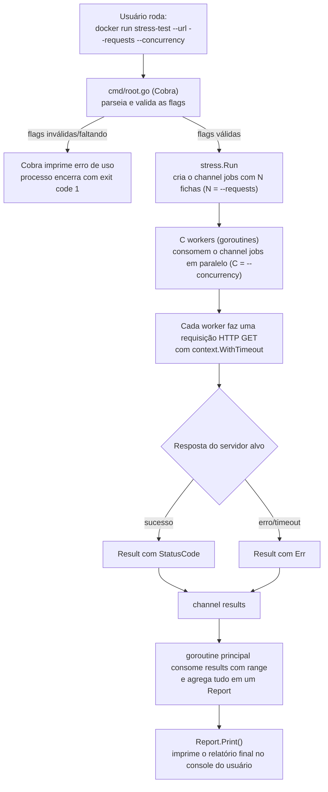

# Stress Test CLI

CLI em Go para realizar testes de carga em serviços web: dispara um número
exato de requisições HTTP contra uma URL, distribuídas por um nível de
concorrência configurável, e gera um relatório com o resultado.

## Sumário

- [Como instalar o projeto](#como-instalar-o-projeto)
- [Como executar o projeto](#como-executar-o-projeto)
- [Como rodar os testes](#como-rodar-os-testes)
- [Arquitetura do projeto](#arquitetura-do-projeto)
- [Fluxograma: da requisição do usuário até a resposta](#fluxograma-da-requisição-do-usuário-até-a-resposta)
- [Resumo de como eu fiz o projeto](#resumo-de-como-eu-fiz-o-projeto)

## Como instalar o projeto

O ambiente de desenvolvimento roda **inteiramente em Docker** — build,
execução e testes. Não é preciso ter Go instalado na máquina, só:

- [Docker](https://docs.docker.com/get-docker/) — Engine 20.10+
- [Docker Compose V2](https://docs.docker.com/compose/install/) — o
  plugin `docker compose` (já incluso no Docker Desktop), não o antigo
  binário standalone `docker-compose` v1

> Testado com Docker 29.7.2 / Docker Compose v5.4.0.

Passos:

```bash
# 1. entre na pasta do projeto
cd 5-stress-test

# 2. copie o template de variáveis de ambiente
cp .env.example .env
```

Não há um passo de build separado: os comandos via Docker Compose de "Como
executar o projeto" e "Como rodar os testes" (mais abaixo) já buildam a
imagem sozinhos, na primeira vez e sempre que o código mudar. A única
exceção é o fluxo `docker run` puro (sem Compose) — como o `docker run`
nunca builda por conta própria, ele exige um `docker build` explícito
antes, documentado a seguir.

O `.env` define os valores padrão usados pelo Docker Compose
(`URL`, `REQUESTS`, `CONCURRENCY`) — ajuste-o se quiser outros valores por
padrão. Isso não afeta o uso do `docker run` "puro", que recebe tudo via
flags na linha de comando.

> Só tem Go instalado localmente e prefere não usar Docker? `go build ./...`
> e `go run .` funcionam normalmente — veja as seções abaixo, cada uma traz
> a alternativa local.

## Como executar o projeto

A forma exigida pelo desafio, sem depender do Compose nem do `.env`. São
dois passos porque `docker run` puro nunca builda sozinho — precisa de um
`docker build` explícito antes:

```bash
docker build -t stress-test .
docker run stress-test --url=http://google.com --requests=1000 --concurrency=10
```

Ou, via Docker Compose, num único comando — a flag `--build` builda (se
necessário) e já roda em seguida, lendo `URL`/`REQUESTS`/`CONCURRENCY` do
`.env` (o Compose substitui essas variáveis no `command:` do serviço antes
de montar o container — o binário continua recebendo tudo como flags,
igual ao `docker run`). O container fica parado (não removido) depois de
imprimir o relatório, pronto para ser limpo com `docker compose stop`/`down`:

```bash
docker compose up --build stress-test
```

> O CLI não imprime nada durante a execução — só o relatório final,
> depois que as `--requests` chamadas terminam (é o que o enunciado do
> desafio pede: relatório "ao final da execução"). Com os valores padrão
> do `.env` (`google.com`, 1000 requests, concorrência 10), isso leva
> uns 1-2 minutos; edite o `.env` (ou use o fluxo `docker run` puro com
> outros valores de flag) se quiser um teste mais rápido.

Ou, via Makefile (atalho para o comando de Compose acima):

```bash
make up                                                          # docker compose up --build stress-test (builda se necessário e roda)
make stop                                                        # docker compose stop (para os containers do projeto)
make destroy                                                     # docker compose down --rmi local --volumes --remove-orphans
```

Sem Docker, com Go instalado localmente:

```bash
go run . --url=http://google.com --requests=1000 --concurrency=10
```

### Flags

| Flag            | Curta | Obrigatória | Descrição                                |
|-----------------|-------|:-----------:|-------------------------------------------|
| `--url`         | `-u`  | sim          | URL do serviço a ser testado              |
| `--requests`    | `-r`  | sim          | Número total de requisições a realizar    |
| `--concurrency` | `-c`  | sim          | Número de chamadas simultâneas            |

Se alguma flag obrigatória faltar, ou `--requests`/`--concurrency` não forem
maiores que zero, o CLI encerra com código de saída `1` e imprime a mensagem
de erro no console.

### Exemplo de saída

```
Tempo total: 4.32s
Total de requests: 1000
Requests com status 200: 950
Distribuição de outros status codes:
  404: 30
  500: 15
Erros de rede/timeout: 5
```

- **Tempo total**: duração de toda a execução, do início da primeira
  requisição até a última resposta.
- **Requests com status 200**: contagem isolada, como pedido no enunciado.
- **Distribuição de outros status codes**: qualquer status diferente de 200,
  ordenado numericamente. Essa seção só aparece se houver algum.
- **Erros de rede/timeout**: requisições que nem chegaram a ter um status
  HTTP (timeout, conexão recusada, DNS não resolvido, etc). Essa linha só
  aparece se houver algum erro — sem ela, a soma dos contadores nem sempre
  bateria com `--requests` em cenários de falha de rede.

## Como rodar os testes

100% em Docker, num único comando, sem precisar de Go instalado (a flag
`--build` builda se necessário, e roda dentro da mesma imagem `builder` do
Dockerfile, que já tem o toolchain Go completo + o código):

```bash
docker compose run --build --rm test
```

Ou, via Makefile:

```bash
make test
```

Com Go instalado localmente, o mesmo comando (`go test ./... -v -race`) roda
direto na máquina:

```bash
go test ./... -v -race
```

Os testes usam `httptest.Server` para simular o serviço alvo e cobrem:
número exato de requisições em diferentes combinações de
concorrência/total, distribuição correta de status codes, respeito ao
limite de concorrência (nunca mais que `--concurrency` requisições em voo
simultaneamente) e contagem de erros de rede.

## Arquitetura do projeto

```
5-stress-test/
├── main.go                     # ponto de entrada: chama cmd.Execute()
├── cmd/
│   └── root.go                 # comando Cobra raiz: flags, validação, delega para internal/stress
├── internal/
│   └── stress/
│       ├── runner.go           # worker pool: dispara as requisições e coleta resultados
│       ├── runner_test.go
│       ├── report.go           # agrega os resultados em um relatório e imprime no console
│       └── report_test.go
├── Dockerfile                  # build multi-stage (stage "builder" reaproveitado pelos testes)
├── docker-compose.yml          # serviços "stress-test" (lê o .env) e "test" (100% em Docker)
├── .env.example                # template das variáveis lidas pelo docker-compose.yml
├── Makefile                    # atalhos: up / stop / destroy / test (via Docker Compose)
└── go.mod / go.sum
```

Separação por responsabilidade, sem camadas extras:

- **`cmd/root.go`** só entende de CLI: lê as flags, valida (`url`
  obrigatório, `requests > 0`, `concurrency > 0`) e delega para o pacote de
  domínio.
- **`internal/stress`** não sabe nada de Cobra nem de flags — recebe
  `url string, requests int, concurrency int` e devolve um `Report`. Isso
  torna o pacote testável isoladamente, apontando para um
  `httptest.Server` em vez de simular linha de comando.
- Dentro de `internal/stress`, **`runner.go`** cuida só do mecanismo de
  concorrência (dispara e coleta); **`report.go`** cuida só da agregação e
  formatação da saída. Dois arquivos pequenos e coesos, em vez de um único
  arquivo misturando goroutines com `fmt.Printf`.

Não há camadas do tipo `domain`/`usecase`/repositório porque o escopo do
desafio — disparar N requisições e contar status codes — não justifica essa
complexidade adicional.

## Fluxograma: da requisição do usuário até a resposta



Passo a passo:

1. O usuário chama o binário (via `docker run`, `docker compose run` ou
   direto) passando `--url`, `--requests` e `--concurrency`.
2. O Cobra (`cmd/root.go`) parseia e valida essas flags. Se algo estiver
   errado, o programa já encerra aqui, sem disparar nenhuma requisição.
3. `stress.Run` cria um channel `jobs` com exatamente `--requests` "fichas"
   e o fecha — isso garante o total exato de requisições, não importa como
   `--requests` e `--concurrency` se relacionam entre si.
4. `--concurrency` workers (goroutines) consomem esse channel em paralelo;
   cada um faz uma requisição HTTP real para a URL alvo, com timeout.
5. Cada worker envia o resultado (status code, ou erro de rede/timeout)
   para o channel `results`.
6. A goroutine principal recebe cada resultado com `range` e vai agregando
   num `Report` — como só ela escreve ali, não precisa de `Mutex`/`atomic`.
7. Quando todos os workers terminam, o channel `results` fecha, o loop
   acaba e `Report.Print()` imprime o relatório final — essa é a "resposta"
   que o usuário vê no console.

## Resumo de como eu fiz o projeto

O projeto usa **apenas** ferramentas e padrões vistos no curso:

- **Cobra** (`github.com/spf13/cobra`) para o parsing de `--url`,
  `--requests` e `--concurrency`, no mesmo estilo ensinado na aula dedicada
  de CLI (`StringVarP`/`IntVarP`, `RunE`, `MarkFlagRequired`).
- **Worker pool com channels + `sync.WaitGroup`**, o padrão de concorrência
  ensinado na aula de multithreading, garantindo o número exato de
  requisições e usando fan-in (em vez de `Mutex`/`atomic`) para agregar os
  resultados com segurança.
- **`context.WithTimeout` + `http.NewRequestWithContext`** para as chamadas
  HTTP, como ensinado na aula de contextos.
- **`testify`** + testes tabela-driven para os testes, como ensinado na aula
  de testes.
- **Docker multi-stage** (`golang:1.26-alpine` → `alpine:latest`), com
  `ENTRYPOINT` (em vez de `CMD`) para que os argumentos de
  `docker run <imagem> --url=... --requests=... --concurrency=...` sejam
  anexados ao binário em vez de substituí-lo por completo. O `docker-compose.yml`
  reaproveita o stage `builder` (toolchain Go completo) tanto para rodar via
  `.env` quanto para rodar a suíte de testes, sem precisar de uma segunda
  imagem nem de Go instalado na máquina.

Não há camadas extras (nenhum `domain`/`usecase`/repositório) porque o
escopo do desafio — disparar N requisições e contar status codes — não
justifica essa complexidade adicional.
