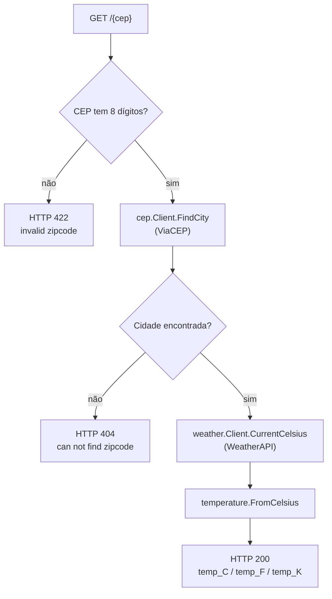

# Clima por CEP

Serviço HTTP em Go que recebe um **CEP** brasileiro, descobre a cidade
correspondente (**ViaCEP**) e retorna a temperatura atual da cidade
(**WeatherAPI**) convertida em Celsius, Fahrenheit e Kelvin. Publicado no
**Google Cloud Run**.

## Sumário

- [URL em produção](#url-em-produção-google-cloud-run)
- [Como instalar](#como-instalar)
- [Como executar o projeto](#como-executar-o-projeto)
- [Como rodar os testes](#como-rodar-os-testes)
- [Configuração](#configuração)
- [Arquitetura do projeto](#arquitetura-do-projeto)
- [Deploy no Google Cloud Run](#deploy-no-google-cloud-run)
- [Resumo de como o projeto foi feito](#resumo-de-como-o-projeto-foi-feito)

---

## URL em produção (Google Cloud Run)

```
GET https://clima-cep-769165890978.southamerica-east1.run.app/{cep}
```

Exemplo:

```bash
curl https://clima-cep-769165890978.southamerica-east1.run.app/01001000
```

### Testando os 3 cenários do contrato

```bash
# Sucesso (200) — CEP válido e existente
curl https://clima-cep-769165890978.southamerica-east1.run.app/01001000

# Formato inválido (422) — menos de 8 dígitos
curl -i https://clima-cep-769165890978.southamerica-east1.run.app/123

# Não encontrado (404) — 8 dígitos, mas CEP inexistente
curl -i https://clima-cep-769165890978.southamerica-east1.run.app/00000000
```

(o `-i` nos dois últimos mostra o status HTTP junto com o corpo da resposta)

Também dá para testar direto pelo navegador: basta colar a URL com um CEP de 8 dígitos no
final, por exemplo `https://clima-cep-769165890978.southamerica-east1.run.app/01310100`.

## Como instalar

O projeto foi pensado para viver **inteiramente dentro do Docker** — não é necessário ter Go
instalado na máquina, nem baixar dependências manualmente. Tudo isso acontece dentro da imagem
quando ela é construída.

Pré-requisitos: **Docker Engine 20.10+** com o plugin **Docker Compose V2**
(`docker compose`, já incluso no Docker Desktop — não o antigo binário
standalone `docker-compose` v1, hoje sem suporte). Testado com Docker
29.7.2 / Compose v5.4.0. O `Makefile` é opcional, só um atalho para os
comandos do compose.

Não há um passo de build separado: `docker compose` builda a imagem
sozinho (resolvendo as dependências do `go.mod` e compilando o binário no
estágio `builder` do `Dockerfile`) na primeira vez que você sobe o projeto
— veja "Como executar o projeto" a seguir.

Antes de subir o projeto, copie o `.env.example` para `.env` e preencha a
`WEATHER_API_KEY` (veja [Configuração](#configuração)):

```bash
cp .env.example .env
```

## Como executar o projeto

```bash
make up
# equivalente a: docker compose up --build
```

Isso sobe a API na porta `8080`.

| Comando | O que faz |
|---|---|
| `make up` | Sobe a API em primeiro plano |
| `make stop` | Para o container do projeto, sem removê-lo |
| `make destroy` | Derruba containers, remove imagens locais (app/test), volumes e redes do projeto |
| `make logs` | Acompanha os logs do app |
| `make ps` | Lista os containers do projeto |

### Testando manualmente

```bash
# Sucesso (200): CEP válido e existente
curl -i localhost:8080/01001000

# Formato inválido (422): CEP sem 8 dígitos
curl -i localhost:8080/123

# Não encontrado (404): CEP com 8 dígitos, mas inexistente
curl -i localhost:8080/00000000
```

## Como rodar os testes

Os testes também rodam só com Docker, sem precisar de Go instalado localmente:

```bash
make test
# equivalente a: docker compose run --build --rm test
```

Esse serviço builda até o estágio `builder` do `Dockerfile` (que ainda tem o código-fonte e o
toolchain do Go) e executa `go test ./... -v`. Nenhum teste depende de acesso real à internet —
as chamadas ao ViaCEP e à WeatherAPI são simuladas com `httptest.NewServer` — então a suíte
inteira roda mesmo sem uma `WEATHER_API_KEY` válida no `.env`.

## Configuração

Todas as configurações vêm de variáveis de ambiente, definidas no arquivo `.env` na raiz do
projeto (não commitado — copie de `.env.example`):

| Variável | Padrão | Descrição |
|---|---|---|
| `PORT` | `8080` | Porta HTTP do servidor. É a mesma variável que o Google Cloud Run injeta automaticamente em produção. |
| `WEATHER_API_KEY` | *(obrigatória)* | Chave de acesso à [WeatherAPI](https://www.weatherapi.com/) (tem plano gratuito). O servidor não sobe sem ela. |

O `docker-compose.yaml` injeta essas variáveis no container via `env_file:
.env` — o binário Go só lê variáveis de ambiente reais (`os.Getenv`), sem
processar o arquivo `.env` sozinho.

## Arquitetura do projeto

```
6-clima-google-cloud-run/
├── cmd/server/main.go          # monta os clients, registra a rota e sobe o servidor
├── internal/
│   ├── cep/                     # resolve a cidade de um CEP
│   │   ├── validator.go          # IsValid(cep) — formato de 8 dígitos
│   │   └── viacep_client.go      # Client.FindCity via ViaCEP; ErrNotFound
│   ├── weather/                  # consulta a temperatura atual de uma cidade
│   │   └── weatherapi_client.go   # Client.CurrentCelsius via WeatherAPI
│   ├── temperature/               # REGRA DE NEGÓCIO — só matemática, não conhece HTTP
│   │   └── convert.go               # FromCelsius(c) -> {temp_C, temp_F, temp_K}
│   └── httphandler/                # ADAPTADOR HTTP — só traduz request ↔ regra de negócio
│       └── weather_handler.go        # valida CEP, chama cep+weather, responde 422/404/200
├── Dockerfile                   # multi-stage: builder (Go) -> imagem final enxuta
├── docker-compose.yaml          # app (8080) + test
└── .env                         # configuração local (não commitado)
```

**Por que essa divisão:** `internal/temperature` é pura regra de negócio — não importa
`net/http` nem sabe de onde veio a temperatura, só faz a conversão. `internal/cep` e
`internal/weather` são adaptadores para APIs externas, cada um com uma única responsabilidade.
`internal/httphandler` não sabe *como* a cidade é resolvida ou a temperatura é buscada — ele
depende só de duas interfaces pequenas (`CityFinder`, `TemperatureFetcher`), definidas no
próprio pacote que as consome, e as implementações concretas (`cep.Client`,
`weather.Client`) são passadas de fora, em `cmd/server/main.go`. Essa separação é o que permite
testar o handler com fakes simples, sem subir HTTP de verdade, e testar os clients de
ViaCEP/WeatherAPI com um servidor HTTP fake (`httptest.NewServer`), sem tocar em regra de
negócio nem em HTTP handler.

**Fluxo de uma requisição:**



Passo a passo do diagrama:

1. O handler extrai o CEP do path (`GET /{cep}`) e valida o formato (8 dígitos numéricos).
2. Se inválido, responde **422** direto, sem chamar nenhuma API externa.
3. Se válido, consulta o ViaCEP para achar a cidade. Se o CEP não existir, responde **404**.
4. Com a cidade em mãos, consulta a WeatherAPI para obter a temperatura atual em Celsius.
5. Converte a temperatura para Fahrenheit e Kelvin (`internal/temperature`) e responde **200**
   com os três valores.

## Deploy no Google Cloud Run

O Cloud Run builda e roda a imagem do `Dockerfile` diretamente — não precisa de um passo de
build separado. Ele também injeta a variável `PORT` automaticamente, e o `main.go` já lê essa
variável (com fallback para `8080` fora do Cloud Run).

```bash
gcloud run deploy clima-cep \
  --project <seu-project-id> \
  --source . \
  --region southamerica-east1 \
  --allow-unauthenticated \
  --set-env-vars WEATHER_API_KEY=<sua-chave-da-weatherapi>
```

Pré-requisitos no projeto GCP (uma vez só): conta de faturamento vinculada e as APIs
`run.googleapis.com` e `cloudbuild.googleapis.com` habilitadas
(`gcloud services enable run.googleapis.com cloudbuild.googleapis.com`).

Ao final, o comando imprime a URL pública do serviço — é ela que está registrada em
[URL em produção](#url-em-produção-google-cloud-run) (projeto
`goexpert-clima-cep-fullcycle`, região `southamerica-east1`).

> A `WEATHER_API_KEY` é um segredo: para produção, prefira `--set-secrets` com o Secret Manager
> em vez de `--set-env-vars` em texto plano.

## Resumo de como o projeto foi feito

O objetivo era resolver o desafio usando só o que já tinha sido visto nas aulas do curso,
evitando bibliotecas ou padrões não vistos sempre que possível. Por isso:

- As chamadas às APIs externas (ViaCEP, WeatherAPI) usam `net/http` puro com
  `context.WithTimeout` + `http.NewRequestWithContext` + `http.Client.Do`, o mesmo padrão visto
  em `desafios/2-multithreading` e `desafios/1-client-server-api` — sem nenhuma lib de HTTP
  client de terceiros.
- O router é o **go-chi** (`chi/v5`), o mesmo já usado no `desafios/4-rate-limiter`.
- As duas únicas variáveis de configuração (`PORT`, `WEATHER_API_KEY`) são lidas direto com
  `os.Getenv` em `main.go` — sem `viper` nem um pacote `configs` dedicado, já que o
  `docker-compose.yaml` cuida de transformar o `.env` em variáveis de ambiente reais do
  container.
- Os testes seguem o mesmo estilo das aulas: tabela de casos com `testing` + `testify/assert`.
  Os clients de ViaCEP/WeatherAPI são testados com `httptest.NewServer` simulando as APIs
  externas (mesmo padrão de `desafios/5-stress-test`), e o handler HTTP é testado com
  `httptest.NewRequest`/`NewRecorder` (mesmo padrão de
  `desafios/4-rate-limiter/internal/httpmiddleware`), usando fakes manuais das interfaces
  `CityFinder`/`TemperatureFetcher` em vez de uma lib de mock.
- **Duas decisões que valem registrar:**
  - O `CHALLANGE.md` escreve a fórmula de Kelvin como `K = C + 273`, mas o exemplo do próprio
    enunciado (`C=28.5 → K=301.65`) só bateria com `+273.15`. Optou-se por seguir a fórmula
    **literal** do enunciado (`+273`), então o resultado para `C=28.5` aqui é `301.5`, não
    `301.65`.
  - Todos os valores de saída (`temp_C`, `temp_F`, `temp_K`) são arredondados para 2 casas
    decimais antes de serializar — só para eliminar ruído de ponto flutuante do `float64`
    (`28.5*1.8+32` dá `83.30000000000001`, não `83.3`).
- Durante os testes manuais contra o ViaCEP real, foi descoberto que o campo `erro` da resposta
  de "CEP não encontrado" vem como **string** (`{"erro":"true"}`), não como booleano — apesar do
  nome sugerir um bool. Por isso, `internal/cep` nem decodifica esse campo: usa a ausência do
  campo `localidade` como sinal de CEP inexistente, que é sempre confiável nos dois casos.
