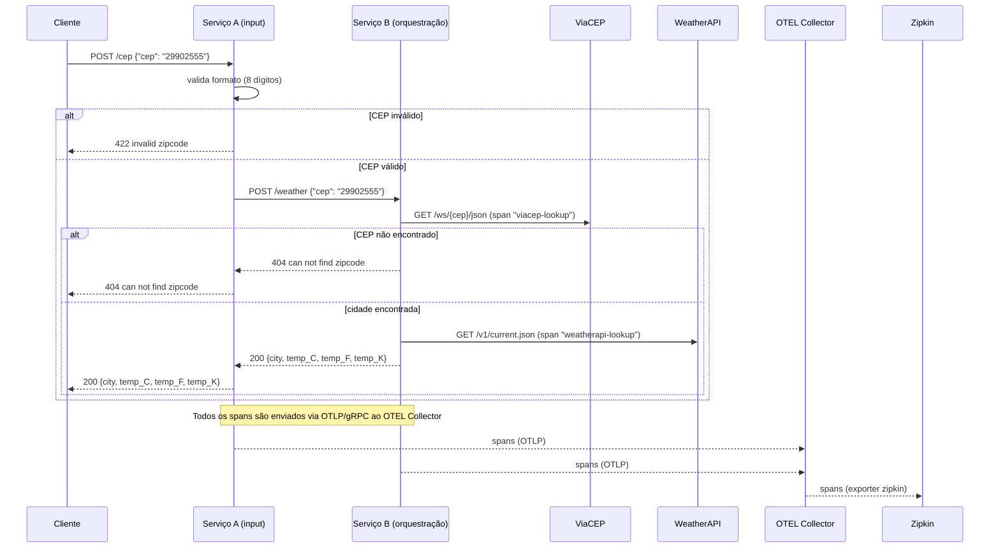

# 7 - Clima por CEP com Observabilidade (OTEL + Zipkin)

Sistema distribuído em Go composto por dois microsserviços que cooperam para, a partir de um CEP, descobrir a cidade e retornar a temperatura atual em Celsius, Fahrenheit e Kelvin — com tracing distribuído instrumentado via OpenTelemetry e visualizado no Zipkin.

## Arquitetura



- **Serviço A (input)**: recebe `POST /cep`, valida que o CEP é uma string de 8 dígitos e encaminha para o Serviço B via HTTP.
- **Serviço B (orquestração)**: recebe `POST /weather`, busca a cidade na ViaCEP, a temperatura na WeatherAPI, converte para as 3 escalas e responde.
- **OTEL Collector**: recebe os traces OTLP/gRPC dos dois serviços e exporta para o Zipkin.
- **Zipkin**: UI de visualização do tracing distribuído.

## Como instalar

Todo o projeto roda via Docker, não é necessário ter Go instalado localmente.

Pré-requisitos: Docker Engine 20.10+ com Compose V2.

Copie o `.env.example` para `.env` e preencha `WEATHER_API_KEY` com uma chave gratuita obtida em [weatherapi.com](https://www.weatherapi.com/):

```bash
cp .env.example .env
```

## Como rodar

```bash
make up
```

| Comando          | Descrição                                                        |
|------------------|-------------------------------------------------------------------|
| `make up`        | Builda (se necessário) e sobe todos os serviços em primeiro plano |
| `make stop`      | Para os containers sem removê-los                                 |
| `make destroy`   | Remove containers, imagens locais, volumes e redes do projeto     |
| `make logs`      | Acompanha os logs de todos os serviços                            |
| `make logs-a`    | Acompanha os logs apenas do `service-a`                           |
| `make logs-b`    | Acompanha os logs apenas do `service-b`                           |
| `make logs-otel` | Acompanha os logs do `otel-collector` (confirma chegada dos spans)|
| `make ps`        | Lista o status dos containers                                     |
| `make test`      | Builda e roda toda a suíte de testes em container isolado         |

### Exemplos de requisição (Serviço A, porta 8080)

Sucesso — 200 OK:
```bash
curl -X POST http://localhost:8080/cep -d '{"cep": "29902555"}'
# {"city":"Linhares","temp_C":28.5,"temp_F":83.3,"temp_K":301.5}
```

CEP com formato inválido — 422:
```bash
curl -X POST http://localhost:8080/cep -d '{"cep": "123"}'
# {"message":"invalid zipcode"}
```

CEP com formato correto mas inexistente — 404:
```bash
curl -X POST http://localhost:8080/cep -d '{"cep": "99999999"}'
# {"message":"can not find zipcode"}
```

## Como visualizar o tracing no Zipkin

Com o stack no ar, abra **http://localhost:9411**.

1. Em "Service Name", selecione `service-a` ou `service-b`.
2. Clique em "Run Query" para listar os traces recentes.
3. Abra um trace: o span raiz é o `POST` recebido pelo `service-a`, com um span filho de chamada HTTP para o `service-b`; dentro do trace do `service-b` aparecem os spans manuais `viacep-lookup` e `weatherapi-lookup`, exigidos pelo desafio para medir o tempo das chamadas às APIs externas.

Se o Zipkin não mostrar nenhum trace, rode `make logs-otel` para conferir se o collector está recebendo e exportando os spans.

## Como rodar os testes

```bash
make test
```

Roda `go test ./... -v` dentro de um container com o estágio `builder` da imagem, sem precisar de Go instalado localmente. Os testes não dependem de rede real — ViaCEP e WeatherAPI são simulados com `httptest.NewServer`.

## Configuração (variáveis de ambiente)

| Variável                      | Default                    | Descrição                                                        |
|--------------------------------|-----------------------------|--------------------------------------------------------------------|
| `SERVICE_A_PORT`               | `8080`                      | Porta HTTP do Serviço A (também usada no mapeamento de porta do compose e no healthcheck) |
| `SERVICE_B_PORT`               | `8081`                      | Porta HTTP do Serviço B (idem); o Serviço A usa esse mesmo valor pra montar a URL de chamada ao B |
| `WEATHER_API_KEY`              | *(obrigatória)*             | Chave da WeatherAPI, usada pelo Serviço B                          |
| `OTEL_EXPORTER_OTLP_ENDPOINT`  | `otel-collector:4317`       | Endpoint gRPC do OTEL Collector (igual para os dois serviços)      |
| `OTEL_SERVICE_NAME`            | `service-a` / `service-b`   | Nome do serviço reportado ao OTEL Collector                        |

Todas vêm do `.env`, exceto `OTEL_SERVICE_NAME`: como o valor precisa ser diferente por container e os dois serviços compartilham o mesmo `.env`, ela é definida direto no `environment:` de cada serviço no `docker-compose.yaml` — é um valor fixo pela topologia (esse container sempre é o "service-a"), não algo que varia por ambiente ou é segredo, então não faz sentido morar no `.env`.

Não existe uma `SERVICE_B_URL` separada: o Serviço A monta a URL do Serviço B em runtime (`http://service-b:<SERVICE_B_PORT>`) usando o próprio `SERVICE_B_PORT` do `.env` compartilhado — assim a porta tem uma única fonte de verdade (mudar `SERVICE_B_PORT` já ajusta automaticamente tanto o que o Serviço B escuta quanto pra onde o Serviço A aponta). Pelo mesmo motivo, as portas mapeadas pro host no `docker-compose.yaml` também são interpoladas do `.env` (`${SERVICE_A_PORT}:${SERVICE_A_PORT}`), em vez de hardcoded.

## Estrutura do projeto

```
7-clima-cep-observabilidade/
├── cmd/
│   ├── service-a/main.go        # entrypoint do Serviço A: wiring, router chi, setup OTEL
│   └── service-b/main.go        # entrypoint do Serviço B: wiring, router chi, setup OTEL
├── internal/
│   ├── platform/otel/           # setup comum do TracerProvider (usado pelos 2 serviços)
│   ├── cep/                     # validação de formato do CEP (regex 8 dígitos)
│   ├── viacep/                  # client ViaCEP; span manual "viacep-lookup"
│   ├── weather/                 # client WeatherAPI; span manual "weatherapi-lookup"
│   ├── temperature/             # lógica pura de conversão Celsius/Fahrenheit/Kelvin
│   ├── serviceaclient/          # client HTTP do Serviço A para chamar o Serviço B
│   └── httphandler/             # adapters HTTP dos dois serviços (dependem de interfaces)
├── Dockerfile                    # multi-stage único; builda o binário certo via --build-arg CMD_PATH
├── otel-collector-config.yaml   # pipeline de traces: OTLP → Zipkin
└── docker-compose.yaml          # sobe service-a, service-b, otel-collector e zipkin
```

Padrão de inversão de dependência: `httphandler` define interfaces pequenas (`CityFinder`, `TemperatureFetcher`, `ServiceBForwarder`) que os clients concretos implementam, injetadas a partir de cada `main.go` — mesmo padrão usado no desafio anterior (`desafios/6-clima-google-cloud-run`).

## Decisões de design

- **Fórmulas de conversão**: usa a fórmula literal do desafio `K = C + 273` (não `+273.15`), e arredonda todas as temperaturas para 2 casas decimais.
- **ViaCEP "não encontrado"**: o campo `erro` da ViaCEP vem como string `"true"`, não booleano — por isso o código trata a ausência do campo `localidade` como CEP não encontrado, em vez de checar `erro`.
- **Propagação de trace via `otelhttp`**: em vez de fazer extract/inject manual do contexto de trace (como em `aulas/labs/otel/comunicacao-ms`), o projeto usa `otelhttp.NewHandler` (servidor) e `otelhttp.NewTransport` (cliente), que propagam automaticamente o header `traceparent` (W3C) — menos código, mesmo resultado, e ainda gera spans HTTP detalhados como filhos dos spans manuais.
- **Exporter Zipkin no Collector**: a imagem "core" `otel/opentelemetry-collector` não inclui o exporter `zipkin`, só a `otel/opentelemetry-collector-contrib`. Sem isso, o Zipkin sobe mas nunca recebe dados (gap observado no material do curso).
- **Um único `Dockerfile` multi-stage, parametrizado por `--build-arg CMD_PATH`** — em vez de dois Dockerfiles quase idênticos, ou de um `target:` nomeado por serviço. A primeira versão usada aqui tinha `target: service-a`/`target: service-b`, mas isso builda **os dois binários sempre juntos** no estágio `builder` compartilhado, mesmo quando só um dos dois é pedido (e o `target: builder` do serviço `test` chegava a compilar os dois à toa, sem nunca usá-los). Com `ARG CMD_PATH`, cada build só compila o binário que precisa, e o `test` não compila nenhum.
- **`OTEL_SERVICE_NAME` no `environment:` do compose, não no `.env`**: é um valor fixo pela topologia (esse container é sempre o "service-a"), não um segredo nem algo que varia por ambiente — por isso fica declarado direto no `docker-compose.yaml`, junto da definição de cada serviço, em vez de exigir um `.env` por serviço só para essa variável.
- **Healthchecks em `service-a`, `service-b` e `zipkin`** (rota `GET /health` nos dois serviços Go, endpoint de actuator padrão do Zipkin), com `depends_on: condition: service_healthy` — sem isso, `depends_on` só espera o container *iniciar*, não a aplicação ficar pronta pra aceitar conexão, e o Serviço A poderia tentar chamar o B antes dele estar de pé. O `otel-collector` **não** tem healthcheck: a imagem `opentelemetry-collector-contrib` não tem shell nem `wget`/`curl`/`nc` (confirmado testando `docker run --entrypoint sh`), então não dá pra checar sem inflar a imagem — trade-off aceito conscientemente.
- **`/health` fora do tracing**: a rota de healthcheck é registrada com `otelhttp.WithFilter(...)` pra não virar span — caso contrário o Zipkin ficaria poluído com um span novo a cada 5 segundos (intervalo do Docker healthcheck), sem valor nenhum pra depuração.
